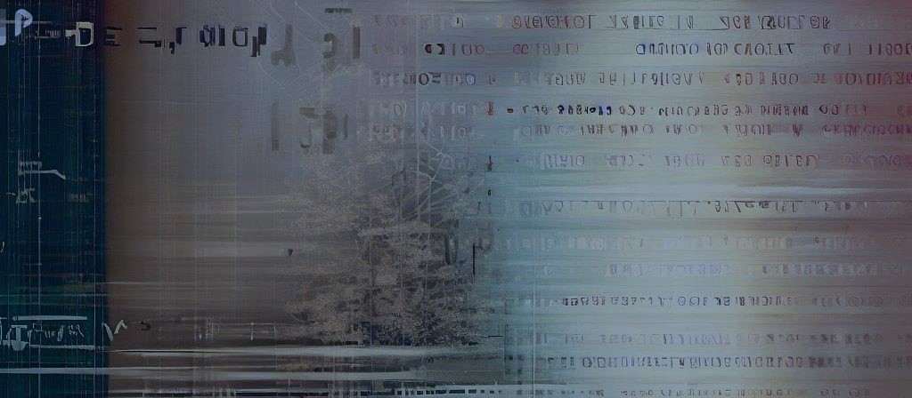

 <!-- Image is self made -->
### Hello Git! 👋

I am a dedicated and ambitious software developer with a secondary passion for cybersecurity and quantum computing. Currently, I'am duel enrolled at both Fort Richmond Colligate and Manitoba Institute of Trades and Technology, studying software development.  .

I have valuable experience as a software developer at CanU Canada, where I created front-end and back-end applications to accept and manage program applications, attendance records, and scholarship applications. I also served as the Chief Technology Officer of an e-commerce company that I co-founded. Further, I worked as the program developer and lecturer for the CanU Canada Physics Program, based within the University of Manitoba campus.

As a competitor in numerous cybersecurity contests, including the Canadian Cyber Defense Challenge, Cyber Patriot, and CyberTitans, I have consistently scored high marks and even earned a silver place as team captain. I was excited to return as the team captain for this year's CyberTitans competition in 2023, where we placed 4th.

I have also completed various certifications, including the Qubit x Qubit Introduction to Quantum Computing, Dell Client, and Cisco certifications, which have enabled me to develop a comprehensive skill set and a profound comprehension of the latest technologies and industry best practices.

 ### Skills

 

### My stats

 
 

- 🔭 I’m currently working on: <a href="https://github.com/BenjaminKaganovitch/Dungeons-and-Dragons-Character-Generator" style="text-decoration: none;"> Dungeons &amp; Dragons Character Generator App </a>

<!--
**BenjaminKaganovitch/BenjaminKaganovitch** is a ✨ _special_ ✨ repository because its `README.md` (this file) appears on your GitHub profile.

Here are some ideas to get you started:

 
- 🌱 I’m currently learning ...
- 💬 Ask me about ...
- 📫 How to reach me: benjamink432@gmail.com
- ⚡ Fun fact: ...
-->
